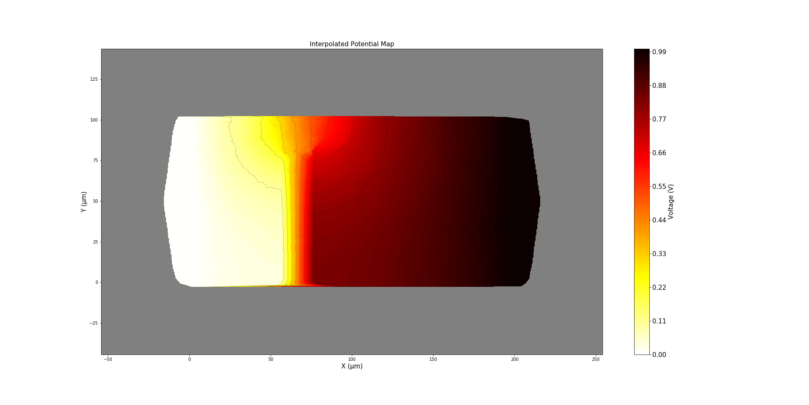

# AgNW network simulation

## Introduction
This simulation is based on the works performed at both LEPMI and LMGP laboratories.
See scientific references at the end

[comment]: <> (2 images side-by-side: https://stackoverflow.com/q/24319505)

<table>
    <tr>
        <td>  </td>
        <td>  </td>
        <td> <a href="http://www.lmgp.grenoble-inp.fr/"> </td>
    </tr>
</table>

Main objectives are:
* Simulate static electrical behaviour of AgNW networks

* Explore dynamic degradation of such networks

## Requirements
 * python v3.x
 * numpy, scipy, matplotlib, pandas
 * networkX 
     * v > 2.4, due to changes on how the lib handles nodes (G.node --> G.nodes)
 
 

## Results

AgNW network:

Voltage map:

## How it works ?
1. Generate random 2D sticks 
1. Compute all intersections points
    
    Using either an external brute-force procedure (Windows only) or KD-tree stucture to perform efficient search

1. Build a graph structure

    intersection point gives 2 nodes on the graph.
    
    Rwire, rcontact
    
    adding two electrodes nodes
    
    
    

## Adding a default
gfgdf, ffggdf

## Network evolution

Destroying one resistor at each iteration

runs | runs
--- | ---
 |  
 |  

## References

Charvin _et al_ (2021): [Dynamic degradation of metallic nanowire networks under electrical stress: a comparison between experiments and simulations](https://doi.org/10.1039/D0NA00895H)

Sannicolo _et al_ (2018): [Electrical Mapping of Silver Nanowire Networks: A Versatile Tool for Imaging Network Homogeneity and Degradation Dynamics during Failure](https://doi.org/10.1021/acsnano.8b01242)

Forro _et al_ (2019): [Predictive Model for the Electrical Transport within Nanowire Networks](https://doi.org/10.1021/acsnano.8b05406)

Da Rocha _et al_ (2015): [Ultimate conductivity performance in metallic nanowire networks](https://doi.org/10.1039/C5NR03905C).
