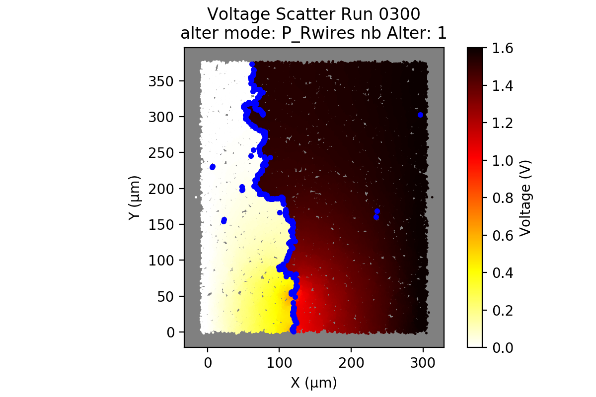

# AgNW network simulation

## Introduction
This simulation is based on the works performed at both LEPMI and LMGP laboratories [1][2].
See scientific references at the bottom of this page

<table>
    <tr>
        <td>  </td>
        <td>  </td>
        <td> <a href="http://www.lmgp.grenoble-inp.fr/"> </td>
    </tr>
</table>

[comment]: <> (2 images side-by-side: https://stackoverflow.com/q/24319505)

<!--
<table>
    <tr>
        <td>  </td>
        <td>  </td>
        <td> <a href="http://www.lmgp.grenoble-inp.fr/"> </td>
    </tr>
</table>
-->

Main objectives are:
* Simulate static electrical behaviour of AgNW networks

* Explore dynamic degradation of such networks

_Citing:     [Dynamic degradation of metallic nanowire networks under electrical stress: a comparison between experiments and simulations](https://doi.org/10.1039/D0NA00895H), Nicolas Charvin, Joao Resende, Dorina Papanastasiou, David Munoz-Rojas, Carmen Jiménez, Ali Nourdine, Daniel Bellet, Lionel Flandin, __Nanoscale Advances__, RSC, 2021_

## Requirements
 * python v3.x
 * numpy, scipy, matplotlib, pandas
 * networkX 
     * v > 2.4, due to changes on how the lib handles nodes (G.node --> G.nodes)
 
 

## Overview

(More details can be found here: )

AgNW network:

Voltage map:

## How it works ?
1. Generate random 2D sticks 

2. Compute all intersections points
    
    1. Using either an external brute-force procedure (Windows only) or KD-tree stucture to perform efficient search
    
3. Build a graph structure, leading to a resistors network

    1. Intersection point gives 2 nodes on the graph.
    
    2. Each AgNW subsegment is transformed in _Rwire_ resistor, while we add a _Rcontact_ resistor between two different intersecting AgNW  (see ref [3])
    
    3. Finalle, adding two terminal nodes, connected to a constant voltage power supply

4. Solve Kirchhoff Current Law  (see ref [4])
    
    
    

## Adding a defect
A defect (ie: a hole, or a slit) can be added to the network.

## Network evolution

Destroying one resistor at each iteration, based on a threshold on the individual currents, and process the remaining network

runs | runs
--- | ---
 |  
 |  

## References

[1] Charvin _et al_ (2021): [Dynamic degradation of metallic nanowire networks under electrical stress: a comparison between experiments and simulations](https://doi.org/10.1039/D0NA00895H), ___Nanoscale Advances___.

[2] Sannicolo _et al_ (2018): [Electrical Mapping of Silver Nanowire Networks: A Versatile Tool for Imaging Network Homogeneity and Degradation Dynamics during Failure](https://doi.org/10.1021/acsnano.8b01242), ___ACS Nano___

[3] Da Rocha _et al_ (2015): [Ultimate conductivity performance in metallic nanowire networks](https://doi.org/10.1039/C5NR03905C), ___Nanoscale___

[4] Forro _et al_ (2019): [Predictive Model for the Electrical Transport within Nanowire Networks](https://doi.org/10.1021/acsnano.8b05406), ___ACS Nano___
