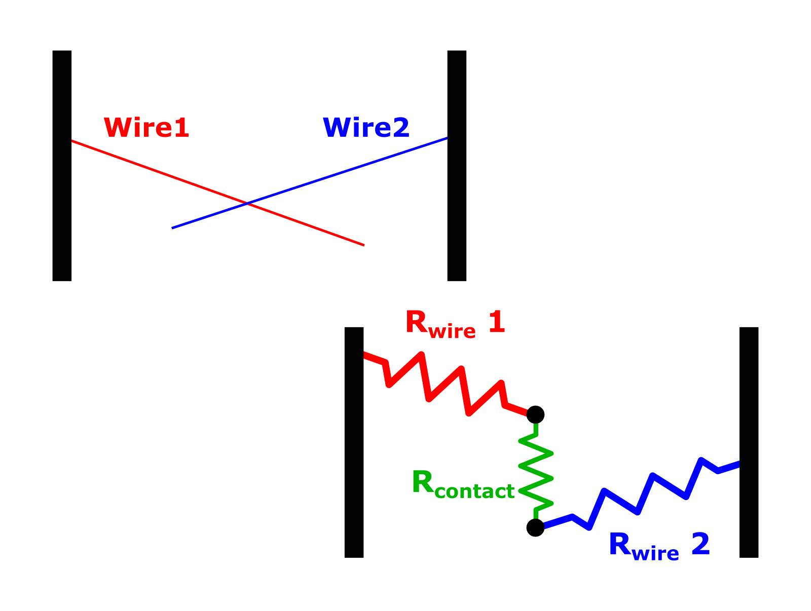

# AgNW network simulation : step-by-step

## Introduction
This simulation is based on the works performed at both LEPMI and LMGP laboratories.
See scientific references at the end

[comment]: <> (2 images side-by-side: https://stackoverflow.com/q/24319505)

<table>
    <tr>
        <td> <a href="http://www.lepmi-guide.univ-smb.fr"> </a> </td>
        <td>  </td>
        <td> <a href="http://www.lmgp.grenoble-inp.fr/"> </td>
    </tr>
</table>

##### Let's explore how we perform silver nanowires network simulation

First, some important imports, either standard (numpy, networkX) or custom (contains utility functions)


```python
# permet des figures "interactives", à la Qt backend, mais c'est bien plus lent
# https://stackoverflow.com/a/34222212
# %matplotlib notebook

import numpy as np
import networkx as nx

import NW_functions_LargeElectrodes_2020 as NF
import KDtree_intersection as KDinter
```

Next, let's define characteristics of the sample we study: 
* sample dimensions $LsX * LsY $ (µm)
* nanowire length $Lw $ (µm)
* network density (defined as $D=N*\frac{Lw^2}{LsX.LsY}$,  with N the number of AgNW on the sample)
* intrinsic NW lineic resistance R<sub>l</sub> (Ohm.µm<sup>-1</sup>)
* contact resistance between NW R<sub>c</sub> (Ohm)
* resistance between electrode pad and NW R<sub>e</sub> (Ohm)
* voltage source level (V)


```python
LsX = 150 #150 
LsY = 100 #100
Lw = 8

Density = 20.
Rlineic_VALUE = 6.
Rc_VALUE = 15.
Relectrode_VALUE = 1e-4
V_SOURCE_LEVEL = 1.
```

Now, let's generate a list of nanowires, based upon these values. Each nanowire is represented by its center coordinates and its angle


```python
nbwires = int(Density * (LsX*LsY) / (Lw*Lw))

XC,YC, AC = NF.Generate_random_centers_and_angles(box_xsize=LsX, box_ysize=LsY, n=nbwires, nw_length=Lw)
NWlist = []
    
for i,(xc,yc,ac) in enumerate(zip(XC,YC,AC)):
    N = NF.Nanowire(index=i, xc=xc, yc=yc, length=Lw, angle_rad=ac)
    NWlist.append(N)
```


```python
NF.Plot_Nanowires_List(NWlist)
```


With all these nanowires cast within our sample, we need to compute all the intersections between them. So, we first write the nanowires coordinates in **'segments.txt'** file, and then compute the intersections efficiently, using a KD-tree search. The intersections are written in **'intersections.txt'** file.


```python
NF.DumpNanowiresListToFile(NWlist, outfilename='segments.txt')
nb_intersections = KDinter.ComputeIntersectionsFile_KD(segmentsFile='segments.txt')

print("There are {0:d} intersections within all these {1:d} nanowires.".format(nb_intersections, len(NWlist)))
```

    Dumping Nanowires list to custom format...
    There are 26346 intersections within all these 4687 nanowires.
    

Once all the intersections point have been computed, we will built a graph structure, representing the percolating electrical network. This structure is based on the works by [Claudia Gomes da Rocha](https://doi.org/10.1039/C5NR03905C) and [Csaba Forro](https://doi.org/10.1021/acsnano.8b05406).

Each sub-segments is transformed into wire resistor (Rwire) and each intersection point is transformed into a contact resistor (Rcontact), schematized as:

[comment]: <> (How-to inser comment in Markdown: https://stackoverflow.com/a/20885980)

[//]: <> (This is also a comment. https://stackoverflow.com/a/14747656)


The sample can then be reduced to a resistor network, represented by a graph, where each edge is a resistor (either of wire or contact type). The ohmic wire resistance is then derived by the length of their sub-segment and the R<sub>l</sub> value.

In the resulting graph structure, we can set attributes to store the characteristics of our sample.


```python
Nodes, Rcontacts, Rwires = NF.BuildNodes_and_Rcontacts_and_Rwires()
G = NF.BuildGraph(nodes=Nodes, rcontacts=Rcontacts, rwires=Rwires, 
                      rlineic=Rlineic_VALUE, rc=Rc_VALUE, lsx=LsX)

G.graph['LsX'] = LsX
G.graph['LsY'] = LsY
G.graph['Lw'] = Lw
G.graph['Rlineic'] = Rlineic_VALUE
G.graph['Rc'] = Rc_VALUE
G.graph['density'] = Density
```


```python
NF.PlotGraph(G, fig_title="original graph")
```


    (<Figure size 432x288 with 1 Axes>,
     <matplotlib.axes._subplots.AxesSubplot at 0x2c2e76c7308>)


So far, nodes are identified by a string, formed by the two names of the nanowires that create theme. For example, if ***nanowire 493*** crosses ***nanowire 1582***, this lead to two nodes ***493_1582*** and ***1582_493***, which define a contact resistor between them. On the opposite, two nodes on the same nanowire (ie ***327_784*** and ***327_1462***) define a wire resistor.

Within our graph data-structure, each node stores:
* x
* y

while each edge stores:
* R<sub>val</sub> :  the resistance of the edge (Ohm)
* R<sub>type</sub> : either R<sub>wire</sub> or R<sub>contact</sub>

Other attributes will be added later.


### We now have to deal with the electrodes

Consider we generate a sample of dimensions LsX * LsY, by randomly throwing nanowires of length Lw. Electrodes are considered as semi-infinitely large rectangles, located on the left and right sides of the sample. The negative electrode (GND) lie within `]-inf, 0]`, while the positive electrode (PLUS) lie within `[LsX: -inf[`

Actually, we throw nanowires whoses centers are randomly drawn in range `[-Lw : LsX+Lw],[0 : LsY]`. It means that some nodes of the graph structure are located over electrodes, either GND or PLUS.

Let's set the `on_electrode` attribute for each node:


```python
for n,d in G.nodes(data=True):
    if d['x'] < 0.0:
        G.nodes[n]['on_electrode']='GND'
    elif d['x'] > LsX:
        G.nodes[n]['on_electrode']='PLUS'
    else:
        G.nodes[n]['on_electrode']=None
```

The electrical behaviour of our sample will be simulated, especially by resolving [Kirchhoff's Current Law](https://en.wikipedia.org/wiki/Kirchhoff's_circuit_laws) (KCL) equations on every node. To perform this, we need to build a matrix, and this imply renaming all nodes with integer indices, starting at `1`. Tricky details will be explained later.

_While this naming scheme could have been implemented earlier, legacy code, blah, blah_


```python
G = nx.convert_node_labels_to_integers(G,first_label=1, label_attribute='node_string')
```

Say there is N nodes in our graph structure. Both electrodes will be represented by special nodes in the graph structure, `0` and `Last`. All nodes lying over electrodes will be linked to theses special nodes, with an edge of R<sub>type</sub>=R<sub>electrode</sub>, whose very small resistance is set to R<sub>e</sub>, defined earlier.

**Tricks in naming nodes: read the comments**


```python
G.add_node(0, x= -2*Lw, y=LsY/2.0, on_electrode='virtual_GND')
nodes_on_electrode_GND = [n for n,data in G.nodes(data=True) if data['on_electrode']=='GND']
    
for n in nodes_on_electrode_GND:
    G.add_edge(0, n, Rval=Relectrode_VALUE, Rtype='Relectrode')
    

        
# Adding virtual node PLUS, whose index is len(G.nodes())  (since G does not contain it yet. Off-by-one trick)
G.add_node(len(G.nodes()), x= LsX+2*Lw, y=LsY/2.0, on_electrode='virtual_PLUS')

    
nodes_on_electrode_PLUS = [n for n,data in G.nodes(data=True) if data['on_electrode']=='PLUS']
    
# tricky: since it was added to G, virtual node PLUS index is now len(G.nodes())-1 . Off-by-one trick once again
# we decide to not assign this index to a variable, because nodes might be removed later, and so nodes indices
# will change.

last_node_index = len(G.nodes())-1
for n in nodes_on_electrode_PLUS:
    #G.add_edge(len(G.nodes())-1, n, Rval=Relectrode_VALUE, Rtype='Relectrode')
    G.add_edge(last_node_index, n, Rval=Relectrode_VALUE, Rtype='Relectrode')
        
print('Node GND = ',G.nodes[0])
print('Node V+  = ',G.nodes[len(G.nodes())-1])
print("Nb nodes: ", len(list(G.nodes()) ) )
print("Nb edges: ", len(list(G.edges()) ) )
```

    Node GND =  {'x': -16, 'y': 50.0, 'on_electrode': 'virtual_GND'}
    Node V+  =  {'x': 216, 'y': 50.0, 'on_electrode': 'virtual_PLUS'}
    Nb nodes:  71468
    Nb edges:  105721
    

Before performing electrical simulations, we need to check is there is a percolating path between the two virtual nodes `0` and `Last`. If so, we will remove all the nodes that are not part of the percolating cluster: 
* we first search the connected component of the graph that contains both virtual nodes.
* we remove all the nodes that are not part of that specific connected component


```python
"""
if (nx.has_path(G, 0, len(G.nodes())-1)):
    print("GOOD: There is a path between both electrodes. Our network is percolating")
    
    for h in nx.connected_components(G):
            if (0 in h) and (len(G.nodes())-1  in h):
                break
    G.remove_nodes_from( [n for n in list(G.nodes()) if n not in h ] )
    
else:
    print("WARNING: no path found between electodes. Nanowires density is probably too small !!")
    print("WARNING: you MUST stop the simulation right now !!")
"""
if NF.IsGraphPercolating(G):
    print("GOOD: There is a path between both electrodes. Our network is percolating")
    print("Let's remove isolated loops (connected components that are not part of the percolating cluster")

    NF.RemoveIsolatedLoops(G)

else:
    print("WARNING: no path found between electodes. Nanowires density is probably too small !!")
    print("WARNING: you MUST stop the simulation right now !!")    
```

    GOOD: There is a path between both electrodes. Our network is percolating
    Let's remove isolated loops (connected components that are not part of the percolating cluster
    

We will also remove ___dangling nodes___ , ie nodes that have less than 2 neighbors, because they do not contribute to electrical conduction. During the simulation, we will have to repeat this step.


```python
NF.RemoveDanglingNodes(G)
        
print("Nb nodes: ", len(list(G.nodes()) ) )
print("Nb edges: ", len(list(G.edges()) ) )
```

    Nb nodes:  71466
    Nb edges:  105719
    

### KCL Matrix building

[Kirchhoff's Current Law](https://en.wikipedia.org/wiki/Kirchhoff's_circuit_laws) states that:
* _for any node (junction) in an electrical circuit, the sum of currents flowing into that node is equal to the sum of currents flowing out of that node; or equivalently: The algebraic sum of currents in a network of conductors meeting at a point is zero_

We decide to apply a current source to our sample, connecting both electrodes.

KCL may be rewritten in matrix from, by inspection of the circuit, that is by scanning all the nodes of our graph.
Av = i , where A is the conductance matrix, i the currents vector and v the unknow voltages vector we wish to determine. Remember that conductance = 1 / resistance

The matrix A is built as follows:
* A<sub>kk</sub> = Sum of the conductances connected to node kk
* A<sub>kj</sub> = A<sub>jk</sub> = Negative of the sum of the conductances directly connecting nodes k and j, with k != j

Ref: _Fundamentals Of Electric Circuits_(ISBN:  978-0078028229)

___In order to build the A matrix automatically, nodes of the graph have to be indexed from 0 to N, without gaps. That means, since we removed dangling nodes, we need to re-indexe all the nodes, sorted by order, so that GND's index is still 0, and PLUS's index the largest one.___

The "NF.BuildMatrixandSolve()" function might take some time to complete. Be patient..


```python
G = nx.convert_node_labels_to_integers(G, label_attribute='node_string',
                                       ordering='sorted')

I_SOURCE_LEVEL = 15.0
vecV, matA, vecI = NF.BuildMatrixandSolve(G, Isource_level=I_SOURCE_LEVEL)
```

Since: 
* Vsolution is the vector of voltages on every node of the graph (Vsolution<sub>k</sub> = voltage on node k)
* The virtual PLUS node is the latest node

This results in having _V<sub>src</sub> = Vsolution[-1]_ Volts applied to our sample. Following Ohm's law, the macroscopic resistance of the sample is ___R<sub>macro</sub> = V<sub>src</sub> / I<sub>source_level</sub>___

Thus, we could _scale_ the source current to adjust to the desired voltage source level to be applied to the sample


```python
Vplus = vecV[-1]
Rmacro = Vplus / I_SOURCE_LEVEL   #(R = U/I)
print("Rmacro = {0:.4} Ohms ".format(Rmacro))

# Scale soluton to desired voltage source level
scaling_factor = V_SOURCE_LEVEL / Vplus
vecV = vecV * scaling_factor
I_macro = I_SOURCE_LEVEL * scaling_factor
```

    Rmacro = 22.4 Ohms 
    

Once the KCL matrix has been solved, we can update the graph structure, by adding new atributes:
* macroscopic resistance of the sample
* voltage source level
* voltages on each node, and individual electric current and power on each edge


```python
G.graph['Rmacro']=Rmacro
G.graph['V_source_level']=V_SOURCE_LEVEL

for index,v in enumerate(vecV):
    G.nodes[index]['v']=vecV[index]

for u,v,d in G.edges(data=True):
    G[u][v]['i'] = np.abs(G.nodes[u]['v']-G.nodes[v]['v']) / d['Rval']
    G[u][v]['p'] = d['Rval'] * (G[u][v]['i'])**2
```

Finally, we can the plot the results


```python
G.graph['step'] = 0

print(G.graph)

NF.PlotScatterVoltages_fromGraph(G, myfontsize=15)
NF.PlotRwiresCurrents_fromGraph(G, myfontsize=15, figtitle='')
```

    {'LsX': 200, 'LsY': 100, 'Lw': 8, 'Rlineic': 6.0, 'Rc': 15.0, 'density': 20.0, 'Rmacro': 22.401199043538675, 'V_source_level': 1.0, 'run': 0, 'step': 0}
    


### Adding a defect

Say we decide to add a defect to the network (here a slit).
Do not forget to check if the graph is still percolating, and to clean the resulting graph, by removing orphan (no neighbors), dangling nodes (only 1 neighbor), isolated loops (connected components of the graph that are not part of the percolating cluster).


```python
# Defect characteristics
slit_xpos=LsX/3
slit_width=20
slit_xleft = slit_xpos - (slit_width/2.0)
slit_xright = slit_xpos + (slit_width/2.0)
slit_height= 0.8*LsY  #20

# Selecting nodes that are part of the defect
nodes_to_remove=[]
for u,v,d in G.edges(data=True):
    if (slit_xleft < G.nodes[u]['x'] < slit_xright) and ( G.nodes[u]['y'] < slit_height):
        nodes_to_remove.append(u)

G.remove_nodes_from(nodes_to_remove) 

if nx.has_path(G, 0, len(G.nodes())-1) == False:
        print("Graph is not percolating anymore after adding default !!!!  QUIT !!!!")

# Cleaning orphan and dangling nodes
print("Orphan cleaning after adding default: ",NF.RemoveOrphanNodes(G), " orphan nodes were removed") 
print("Dangling cleaning: ",NF.RemoveDanglingNodes(G), " dangling nodes were removed")

# Removing isolated loops.  Using "_" to supress output in JupyterNotebook
_ = NF.RemoveIsolatedLoops(G)
```

    Orphan cleaning after adding default:  248  orphan nodes were removed
    Dangling cleaning:  48  dangling nodes were removed
    

Once again, we can build and solve the KCL matrix, scale to the desired voltage source level, save voltages and currents, and finally plot results


```python
G = nx.convert_node_labels_to_integers(G, label_attribute='node_string',ordering='sorted')

I_SOURCE_LEVEL = 1.0
vecV, matA, vecI = NF.BuildMatrixandSolve(G, Isource_level=I_SOURCE_LEVEL)


Vplus = vecV[-1]
Rmacro = Vplus / I_SOURCE_LEVEL   #(R = U/I)
print("Rmacro = {0:.4} Ohms ".format(Rmacro))

# Scale soluton to desired voltage source level
scaling_factor = V_SOURCE_LEVEL / Vplus
vecV = vecV * scaling_factor
I_macro = I_SOURCE_LEVEL * scaling_factor

G.graph['Rmacro']=Rmacro
G.graph['V_source_level']=V_SOURCE_LEVEL

for index,v in enumerate(vecV):
    G.nodes[index]['v']=vecV[index]


for u,v,d in G.edges(data=True):
    G[u][v]['i'] = np.abs(G.nodes[u]['v']-G.nodes[v]['v']) / d['Rval']
    G[u][v]['p'] = d['Rval'] * (G[u][v]['i'])**2


    
NF.PlotScatterVoltages_fromGraph(G, myfontsize=15)
NF.PlotRwiresCurrents_fromGraph(G, myfontsize=15, figtitle='')
    

#  Save X,Y,Voltages to a .npz file.  Same for X,Y,Currents
#NF.SaveScatterVoltages(G)
#NF.SaveScatterCurrents(G)
```

    Rmacro = 49.33 Ohms 
    


## References

[1] Charvin _et al_ (2021): [Dynamic degradation of metallic nanowire networks under electrical stress: a comparison between experiments and simulations](https://doi.org/10.1039/D0NA00895H), ___Nanoscale Advances___.

[2] Sannicolo _et al_ (2018): [Electrical Mapping of Silver Nanowire Networks: A Versatile Tool for Imaging Network Homogeneity and Degradation Dynamics during Failure](https://doi.org/10.1021/acsnano.8b01242), ___ACS Nano___

[3] Da Rocha _et al_ (2015): [Ultimate conductivity performance in metallic nanowire networks](https://doi.org/10.1039/C5NR03905C), ___Nanoscale___

[4] Forro _et al_ (2019): [Predictive Model for the Electrical Transport within Nanowire Networks](https://doi.org/10.1021/acsnano.8b05406), ___ACS Nano___
